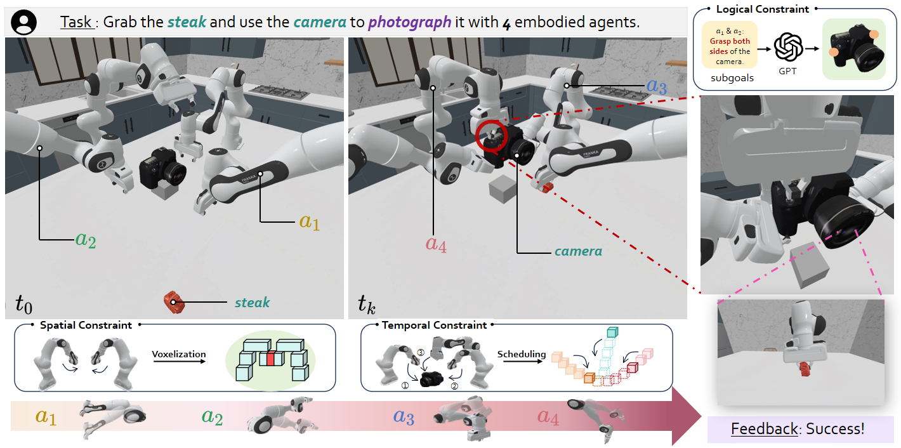

<div align="center">
<h1>OpenMARL: Open Multi-Agent Reinforcement Learning</h1>

<a href="https://arxiv.org/abs/2503.16408"></a>
<a href="https://iranqin.github.io/robofactory/"></a>
<a href='https://huggingface.co/datasets/FACEONG/RoboFactory_Dataset'></a>
</div>

## 🧠 Overview

OpenMARL is an open-source framework for multi-agent reinforcement learning in embodied AI. It features **RoboFactory**, a benchmark for embodied multi-agent manipulation based on [ManiSkill](https://www.maniskill.ai/). Leveraging compositional constraints and specifically designed interfaces, OpenMARL provides an automated data collection framework for embodied multi-agent systems.

<div align="center">
  
</div>

---

## 📁 Project Structure

```
OpenMARL/
├── train.sh                    # 🚀 Unified training entry point
├── eval.sh                     # 📊 Unified evaluation entry point
├── README.md                   # This file
│
├── robofactory/
│   ├── configs/                # Task configurations
│   │   ├── table/              # Table scene tasks
│   │   └── robocasa/           # RoboCasa scene tasks
│   │
│   ├── data/                   # Datasets
│   │   ├── h5_data/            # Raw H5 data
│   │   ├── pkl_data/           # Pickle format
│   │   ├── zarr_data/          # ZARR format (for Diffusion Policy)
│   │   └── rlds_data/          # RLDS format (for OpenVLA)
│   │
│   ├── policy/                 # Policy implementations
│   │   ├── Diffusion-Policy/   # Diffusion Policy (CNN-based)
│   │   │   └── README.md       # 📖 DP-specific documentation
│   │   └── OpenVLA/            # Vision-Language-Action Model
│   │       └── README.md       # 📖 OpenVLA-specific documentation
│   │
│   ├── tasks/                  # Task definitions
│   ├── planner/                # Motion planning
│   ├── prepare_all_data.sh     # Data preparation script
│   └── requirements.txt        # Dependencies
│
├── checkpoints/                # Trained model checkpoints
└── logs/                       # Training logs
```

---

## 🚀 Quick Start

### 1. Installation

First, clone this repository to your local machine, and install [vulkan](https://maniskill.readthedocs.io/en/latest/user_guide/getting_started/installation.html#vulkan) and the following dependencies.

```bash
git clone https://github.com/ChristianLin0420/OpenMARL.git
conda create -n openmarl python=3.9
conda activate openmarl
cd OpenMARL
pip install -e .
cd robofactory
pip install -r requirements.txt
# (optional): conda install -c conda-forge networkx=2.5
```

### 2. Download Assets

Then download the 3D assets for RoboFactory tasks:

```bash
cd robofactory
python script/download_assets.py 
```

For complex scenes like [RoboCasa](https://github.com/robocasa/robocasa), download them using the following command. Note that if you use these scenes in your work please cite the scene dataset authors.

```bash
python -m mani_skill.utils.download_asset RoboCasa
```

### 3. Run a Task

Now, try to run a task with just a line of code:

```bash
# Table scene
python script/run_task.py configs/table/lift_barrier.yaml

# RoboCasa scene (after downloading RoboCasa assets)
python script/run_task.py configs/robocasa/lift_barrier.yaml
```

### 🛠 Installing OpenGL/EGL Dependencies on Headless Debian Servers

If you are running simulation environments on a **headless Debian server** without a graphical desktop, you will need to install a minimal set of OpenGL and EGL libraries to ensure compatibility.

Run the following commands to install the necessary runtime libraries:

```bash
sudo apt update
sudo apt install libgl1 libglvnd0 libegl1-mesa libgles2-mesa libopengl0
```

---

## 📦 Data Preparation

### Option 1: Automated Data Preparation (Recommended)

We provide an automated script that handles all data generation and processing steps for all tasks:

```bash
cd robofactory
hf auth login # Robocasa required huggingface token to access
bash prepare_all_data.sh
```

This script will:
1. Download required assets
2. Generate demonstration data for all tasks (150 episodes each)
3. Convert data from H5 → PKL → ZARR format automatically
4. Skip already prepared tasks to save time

The script processes both `table` and `robocasa` scene types for all available tasks.

**Note:** The data preparation process can take several hours depending on your hardware.

### Option 2: Manual Data Generation (For Individual Tasks)

If you want to generate data for a specific task:

```bash
# Format: python script/generate_data.py --config {config_path} --num {traj_num} [--save-video]
python script/generate_data.py --config configs/table/lift_barrier.yaml --num 150 --save-video
```

The generated demonstration data will be saved in the `demos/` folder.

### Data Processing

If you generated data manually, you need to convert it to the appropriate format:

```bash
# 1. Create data directories (first time only)
mkdir -p data/{h5_data,pkl_data,zarr_data,rlds_data}

# 2. Move your H5 and JSON files to data/h5_data/
mv demos/{task_name}/motionplanning/*.h5 data/h5_data/{task_name}.h5
mv demos/{task_name}/motionplanning/*.json data/h5_data/{task_name}.json

# 3. Convert H5 → PKL (handles both single and multi-agent tasks)
python script/parse_h5_to_pkl_multi.py --task_name LiftBarrier-rf --load_num 150 --agent_num 2

# 4. Convert PKL → ZARR (for Diffusion Policy, for each agent)
python script/parse_pkl_to_zarr_dp.py --task_name LiftBarrier-rf --load_num 150 --agent_id 0
python script/parse_pkl_to_zarr_dp.py --task_name LiftBarrier-rf --load_num 150 --agent_id 1

# 5. (For OpenVLA) Convert ZARR → RLDS
python policy/OpenVLA/openvla_policy/utils/data_conversion.py \
    --zarr_path data/zarr_data --output_dir data/rlds_data --batch
```

---

## 🎯 Unified Training Interface

**Single command to train any policy:**

```bash
# Diffusion Policy (single GPU)
bash train.sh --policy dp --task LiftBarrier-rf --agent_id 0 --seed 100

# OpenVLA (multi-GPU)
bash train.sh --policy openvla --task LiftBarrier-rf --agent_id 0 --gpus 8

# Train all agents for a task
bash train.sh --policy dp --task LiftBarrier-rf --all_agents

# Show all options
bash train.sh --help
```

### Training Options

| Option | Description | Default |
|--------|-------------|---------|
| `--policy` | Policy type: `dp` or `openvla` | `dp` |
| `--task` | Task name (e.g., `LiftBarrier-rf`) | Required |
| `--agent_id` | Agent ID (0, 1, 2, ...) | Required* |
| `--gpus` | Number of GPUs (>1 enables multi-GPU) | `1` |
| `--seed` | Random seed | `100` |
| `--batch_size` | Batch size | Policy default |
| `--data_num` | Number of data episodes | `150` |
| `--debug` | Enable debug mode | `false` |
| `--wandb` | Wandb mode: `online`, `offline`, `disabled` | `online` |
| `--all_agents` | Train all agents sequentially | `false` |

*Required unless `--all_agents` is used

---

## 📊 Unified Evaluation Interface

```bash
# Evaluate Diffusion Policy
bash eval.sh --policy dp --task LiftBarrier-rf --config configs/table/lift_barrier.yaml

# Evaluate OpenVLA with specific checkpoint
bash eval.sh --policy openvla --task LiftBarrier-rf --config configs/table/lift_barrier.yaml --checkpoint 300

# Quick debug evaluation
bash eval.sh --policy dp --task LiftBarrier-rf --config configs/table/lift_barrier.yaml --debug 1 --num_eval 10

# Show all options
bash eval.sh --help
```

### Evaluation Options

| Option | Description | Default |
|--------|-------------|---------|
| `--policy` | Policy type: `dp` or `openvla` | `dp` |
| `--task` | Task name | Required |
| `--config` | Config file path | Required |
| `--checkpoint` | Checkpoint epoch | `300` |
| `--data_num` | Training data episodes | `150` |
| `--debug` | Debug mode (0=quiet, 1=verbose) | `0` |
| `--num_eval` | Number of evaluation episodes | `100` |
| `--seed` | Starting evaluation seed | `1000` |
| `--max_steps` | Max steps per episode | `250` |

---

## 🤖 Supported Policies

| Policy | Type | Data Format | Multi-GPU | Documentation |
|--------|------|-------------|-----------|---------------|
| **Diffusion Policy** | CNN-based diffusion | ZARR | ✅ Multi-GPU | [📖 README](robofactory/policy/Diffusion-Policy/README.md) |
| **OpenVLA** | Vision-Language-Action | RLDS | ✅ Multi-GPU | [📖 README](robofactory/policy/OpenVLA/README.md) |

### Policy-Specific Documentation

- **[Diffusion Policy Guide](robofactory/policy/Diffusion-Policy/README.md)**: CNN-based diffusion model for robotic manipulation
- **[OpenVLA Guide](robofactory/policy/OpenVLA/README.md)**: Vision-Language-Action model with LoRA fine-tuning, Docker support, and multi-GPU training

---

## 📋 Available Tasks

| Task | Agents | Description |
|------|--------|-------------|
| `LiftBarrier-rf` | 2 | Cooperatively lift a barrier |
| `CameraAlignment-rf` | 3 | Align camera with target |
| `PassShoe-rf` | 2 | Pass object between robots |
| `PlaceFood-rf` | 2 | Place food on plate |
| `TakePhoto-rf` | 4 | Coordinate to take photo |
| `StackCube-rf` | 1 | Stack cubes cooperatively |
| `StrikeCube-rf` | 1 | Strike cube to target |
| `PickMeat-rf` | 1 | Pick up meat cooperatively |
| `ThreeRobotsStackCube-rf` | 3 | Three-robot cube stacking |
| `TwoRobotsStackCube-rf` | 2 | Two-robot cube stacking |
| `LongPipelineDelivery-rf` | 4+ | Multi-agent pipeline delivery |

---

## 📝 TODO: Future Development

### High Priority
- [ ] **ACT Policy**: Add Action Chunking Transformer support
- [ ] **RT-1/RT-2**: Add Robotics Transformer policies
- [ ] **Multi-GPU for DP**: Enable distributed training for Diffusion Policy
- [ ] **Unified Config Schema**: Merge policy configs into single schema

### Medium Priority
- [ ] **Unified Checkpointing**: Common checkpoint format across policies
- [ ] **Training Dashboard**: Real-time training visualization
- [ ] **Hyperparameter Tuning**: Automated hyperparameter optimization
- [ ] **Model Ensemble**: Combine multiple policies for better performance

### Low Priority
- [ ] **Cloud Training**: AWS/GCP/Azure integration
- [ ] **Model Hub**: Upload trained models to HuggingFace
- [ ] **Benchmarking Suite**: Automated performance comparison across policies
- [ ] **Mobile Deployment**: Export models for edge devices

### Completed
- [x] Unified training script (`train.sh`)
- [x] Unified evaluation script (`eval.sh`)
- [x] Multi-GPU support for OpenVLA
- [x] Docker containerization for OpenVLA
- [x] Wandb integration for experiment tracking
- [x] GPU simulation backend support

---

## 🐳 Docker Support

For containerized training and deployment, see the [OpenVLA Docker Guide](robofactory/policy/OpenVLA/README.md#-docker-usage).

Quick start:
```bash
# Build Docker image
cd OpenMARL
docker build -t openmarl/openvla:latest -f robofactory/policy/OpenVLA/Dockerfile .

# Run training in Docker
docker run --gpus all -it --rm --shm-size=32g \
    -v $(pwd):/workspace/OpenMARL \
    openmarl/openvla:latest \
    bash -c "bash train.sh --policy openvla --task LiftBarrier-rf --agent_id 0 --gpus 8"
```

---

## 🔗 Community & Contact

For any questions or research collaboration opportunities, please don't hesitate to reach out:
- yiranqin@link.cuhk.edu.cn
- faceong02@gmail.com
- akikaze@sjtu.edu.cn

---

## 📚 Citation

If you use this code in your research, please cite:

```bibtex
@article{qin2025robofactory,
  title={RoboFactory: Exploring Embodied Agent Collaboration with Compositional Constraints},
  author={Qin, Yiran and Kang, Li and Song, Xiufeng and Yin, Zhenfei and Liu, Xiaohong and Liu, Xihui and Zhang, Ruimao and Bai, Lei},
  journal={arXiv preprint arXiv:2503.16408},
  year={2025}
}
```

For OpenVLA-specific work, please also cite:

```bibtex
@article{kim24openvla,
  title={OpenVLA: An Open-Source Vision-Language-Action Model},
  author={{Moo Jin} Kim and Karl Pertsch and Siddharth Karamcheti and Ted Xiao and Ashwin Balakrishna and Suraj Nair and Rafael Rafailov and Ethan Foster and Grace Lam and Pannag Sanketi and Quan Vuong and Thomas Kollar and Benjamin Burchfiel and Russ Tedrake and Dorsa Sadigh and Sergey Levine and Percy Liang and Chelsea Finn},
  journal={arXiv preprint arXiv:2406.09246},
  year={2024}
}
```
